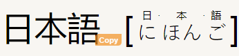

日本語

 
 
**Simple sentences**
 
 

1) *だいじょぶ？*
 
  *はい！
   だいじょぶです！*
 
  *How are you?*
 
  *Yes!*
  *i´m fine!*
 
 
2) *おなまえわ？*
 
  *わたしはすに,みりえ,えヴぇりです！*
 
  *Whats your name?*
 
  *My name is Suny Millie Evellyn!*
 
 
3) *はじめまして、私はうさぎです！
  どうぞよろしく!*
 
  *Nice to meet you, my name is Usagi!
   be nice to me!*
 
 
4) *行きそうだ!* 
 
  *I´m gonna cum!"
 
 
5) *楽しみたい❣！　
 or　
 たのしたい❣！*
  *I want to have fun!*
 
 
6) *いきたい*
  *I want to cum*
 
 
7) *わたしのわかのじょかわいいね❢！*
  *私(watashi)のはかのじょかわいいね*
 
 
    *My girlfriend is so cute!*
 
 
8) *すしがたべたい!  
or
  寿司が食べたい!*
 
  *I want to eat sushi!*